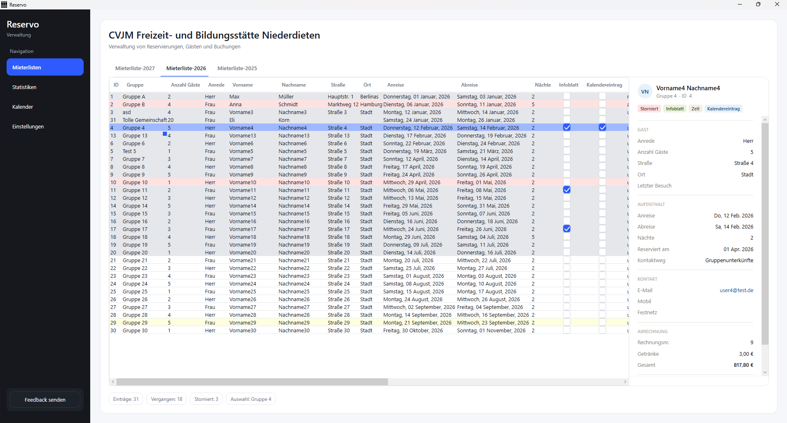

# Reservo

Reservo ist eine WPF-Desktopanwendung zur Verwaltung von Mieter- und Reservierungsdaten für den Ferienbetrieb. Sie ermöglicht das Laden, Bearbeiten und Speichern von Reservierungsdaten aus Excel-Dateien sowie die automatische Erstellung von Reservierungsbestätigungen und Rechnungen als Word- und PDF-Dokumente.

> **Hinweis:** Reservo ist als internes Tool für die eigene Verwaltung entstanden und richtet sich nicht an ein allgemeines Publikum. Pfade, Vorlagen und externe Dienste (Trello, Kalender, E-Mail) sind auf den eigenen Anwendungsfall zugeschnitten.

## Features

- 📊 **Datenverwaltung** – Laden, Bearbeiten und Speichern von Mieter- und Reservierungsdaten aus jahrgangsweise organisierten Excel-Dateien (`.xlsx`), inklusive automatischer Backups vor jedem Speichervorgang
- 🧾 **Reservierungen & Rechnungen** – automatische Erstellung von Reservierungsbestätigungen (Word) und Rechnungen (Word/PDF) aus Vorlagen, mit direktem Versand per E-Mail
- 📅 **Kalender-Integration** – Erkennung von Datumsüberschneidungen zwischen Buchungen sowie Anlage von Terminen im Google Kalender
- 📈 **Statistiken** – Auswertung von Gästezahlen, vergangenen und stornierten Buchungen sowie grafische Aufbereitung mit OxyPlot
- 🕒 **Feiertagsberechnung** – Berücksichtigung gesetzlicher Feiertage bei Auswertungen (über die PublicHoliday-Bibliothek)
- 📬 **Feedback-System** – Übermittlung von Feedback direkt als Trello-Karte
- 🔔 **Benachrichtigungen** – Hinweise auf anstehende Anreisen als In-App-Toast
- 🔐 **Zugangsdaten-Verwaltung** – lokale Speicherung (verschlüsselt) sowie optionaler Abgleich mit einem externen Credential-Server
- 🧩 **MVVM-Architektur** – klare Trennung von Views, ViewModels, Models und Services
- 📝 **Logging** – strukturiertes Logging mit Serilog (Datei- und Debug-Sink)

## Screenshots



## Technologien

| Bereich | Technologie |
|---|---|
| UI-Framework | WPF (.NET 8, `net8.0-windows`) |
| Sprache | C# |
| Architektur | MVVM |
| Excel-Zugriff | ClosedXML, ExcelDataReader |
| Word-/PDF-Erstellung | DocX (Xceed), DocumentFormat.OpenXml, Microsoft Word Interop |
| E-Mail-Versand | MailKit |
| Diagramme | OxyPlot.Wpf |
| Feiertage | PublicHoliday |
| Benachrichtigungen | Notification.Wpf |
| Logging | Serilog |
| Feedback | Trello REST API |

## Voraussetzungen

- Windows 10/11
- [.NET 8 SDK](https://dotnet.microsoft.com/download/dotnet/8.0)
- Microsoft Word (für die PDF-Erzeugung über die Word-Interop-Schnittstelle)

## Installation & Start

```bash
git clone https://github.com/<dein-benutzername>/Reservo.git
cd Reservo
dotnet restore
dotnet build
dotnet run
```

Beim ersten Start legt Reservo automatisch die benötigte Ordnerstruktur sowie leere Excel-Datenbanken für das aktuelle und das folgende Jahr im Dokumente-Verzeichnis (`Dokumente\Verwaltung`) an.

## Konfiguration

Zugangsdaten und interne Einstellungen (Datenbankpfad, Kalender-ID, SMTP- und Trello-Zugangsdaten) werden über die **Einstellungen**-Ansicht der Anwendung gepflegt und lokal verschlüsselt unter `Dokumente\Verwaltung\Resources\internCredentials.json` abgelegt. Für den optionalen Abgleich mit einem externen Credential-Server wird die Umgebungsvariable `CREDENTIAL_API_KEY` benötigt.

## Projektstruktur

```
Reservo/
├── Models/          # Datenmodelle (Entry, GuestInfo, StayInfo, BillingInfo, …)
├── ViewModels/       # MVVM-ViewModels je View
├── Views/            # WPF-Views (XAML)
├── Services/         # Fachliche Dienste (Dokumente, E-Mail, Dialoge, Zugangsdaten, …)
├── Helpers/          # Hilfsklassen (u. a. Excel-Zugriff, Datumsanalyse)
├── Converters/        # WPF Value-Converter
├── Commands/          # ICommand-Implementierungen (RelayCommand, AsyncRelayCommand)
├── Infrastructure/    # Pfade, Logging-Konfiguration, statische Konfigurationswerte
└── Themes/            # Styles und Ressourcen-Dictionaries
```
